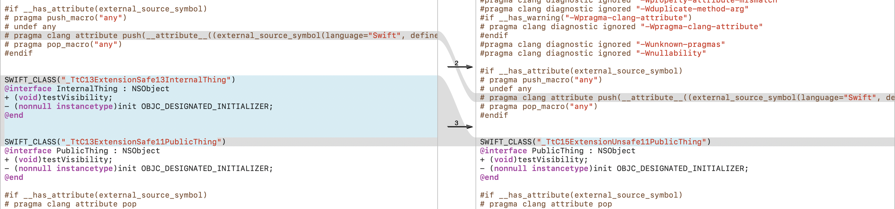

# Summary
Illustrate the difference in the generated header with/without `APPLICATION_EXTENSION_API_ONLY`/`-application-extension`.

|ExtensionSafe vs. ExtensionUnsafe|
|---|
||

Generated from Xcode `Version 12.5 (12E262)`.

# Generate Diff Locally

```
$ brew install xcodegen
$ xcodegen --spec xcodegen.yml
$ ./print_header_diff.sh
```

# Explanation

Thi explained this within the Swift codebase with: https://twitter.com/thi_dt/status/1443458824237576195?s=20&t=DkvDlMh0QIq5kXXT1n43vw

https://github.com/apple/swift/blob/deb02c188cdf91d73008e74c030774c3cbc11a74/include/swift/AST/Module.h#L809-L813

https://github.com/apple/swift/blob/b223e9dcb72204fc85b05020fc62a7b07f0959ab/lib/AST/Module.cpp#L1838-L1843
